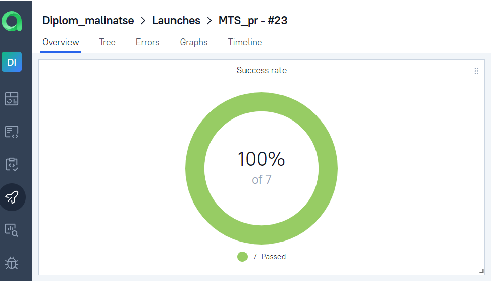
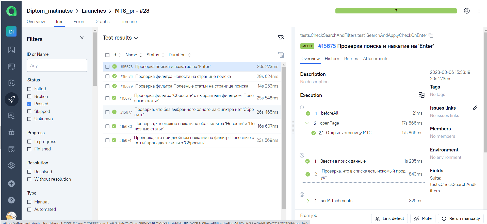
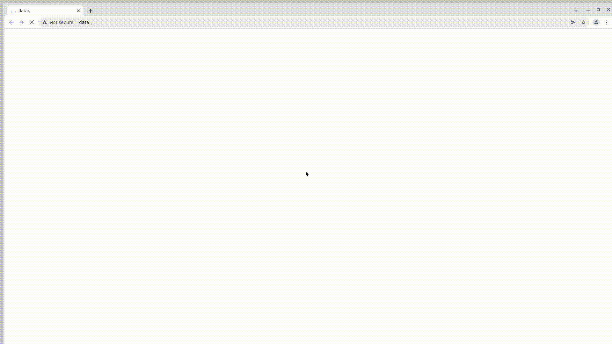

<h1 >Демопроект автоматизации тестирования API на <a href="https://reqres.in/">reqres.in</a></h1>
## :maple_leaf: Содержание:

- Технологии и инструменты
- Список проверок, реализованных в тестах
- Запуск тестов (сборка в Jenkins)
- Allure-отчет
- Интеграция с Allure TestOps
- Интеграция с Atlassian Jira
- Уведомление в Telegram о результатах прогона тестов

## :maple_leaf:Технологии и инструменты

<p  align="left"

<code></code>
<code></code>
<code></code>
<code></code>
<code></code>
<code></code>
<code></code>
<code></code>
<code></code>
<code></code>
</p>

## :heavy_check_mark: Тест кейсы

- Создание нового пользователя
- Обновление данных пользователя
- Удаление пользователя
- Проверка количества пользователей на странице
- Проверка значений пользователя в списке с помощью Groovy


##  Запуск тестов из терминала :computer:

1. Запуск с командной строки:
```gradle clean test```
2. Получение отчёта: ```gradle allureServe```
3. Результат запуска сборки можно посмотреть в отчёте Allure

 
##  Запуск тестов в Jenkins
1. Для запуска сборки необходимо открыть  <a target="_blank" href="https://jenkins.autotests.cloud/job/HW20/">проект</a> . 
2. Указать значения параметров и нажать кнопку ```Собрать```.
3. Результат запуска сборки можно посмотреть в отчёте Allure.


После завершения сборки результаты тестирования доступны в:
>- <code><strong>*Allure Report*</strong></code>
>- <code><strong>*Allure TestOps*</strong></code> - результаты загружаются туда и тест-кейсы могут автоматически обновляться в соответствии с последними изменениями в коде.

##  Отчет о результатах тестирования в Allure Report :bar_chart:
###  Основной Дашборд ###
Для перехода к просмотру отчета в разделе "История сборок" нажать значок "Allure Report", откроется страница с отчетом по прохождению.


###  Группировка тестов по проверяемому функционалу ###


##  Уведомления в Telegram с использованием бота

После завершения сборки, Вам будет отправлено уведомление в ```Telegram``` с отчетом о прохождении.


##  Интеграция с [Allure TestOps](https://allure.autotests.cloud/launch/18485)
### Основной дашборд

<p align="center">
  
</p>

### Список тестов с результатами прогона

<p align="center">
  
</p>


##  Пример запуска теста в Selenoid :film_strip:

К каждому тесту в отчете прилагается видео. Одно из таких видео представлено ниже.
<p align="center">
  
</p>

